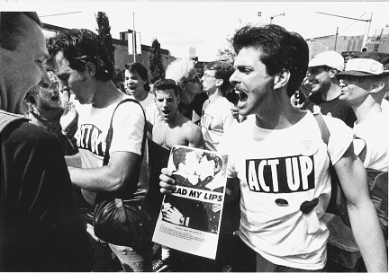

# ACT UP ORAL HISTORIES ANALYSIS

---

## Assignment for HIS4936, [Hacking History](http://hacking-history.readthedocs.io)

---



---

REMEMBER TO USE THE [Markdown Cheatsheet here](https://github.com/adam-p/markdown-here/wiki/Markdown-Cheatsheet).

FOR ALL EXTERNAL LINKS OR IMAGES, JUST PAST THE URL INSIDE THE PARENTHESES

FOR LOCAL LINKS OR IMAGES, ALL PATHS START FROM THE `docs` DIRECTORY. SO TO
LINK TO ANY IMAGE YOU STORED DIRECTLY INSIDE THE `imgs` DIRECTORY, YOU ONLY
NEED TO MAKE THE PATH LIKE THIS `imgs/some_image.jpg`. NOTE: YOU SHOULD *NOT*
START PATHS WITH A `/`. See the examples above.

---

WHEN COMPOSING YOUR PROPOSAL REMEMBER YOU CAN...

* Remember that you can...
* Put items in lists
* Even
    * Nested
    * Lists

1. You can also
2. Use numbered
    1. Lists
    2. And Nest them

---

Use triple dashes (like below) to separate sections of your text

---

Remember you can use `single backticks` to quote code inline, or use triple
backticks to make a blockquote of code (you can even specify the language,
if you want).

```markdown

# Quoted Markdown

When this is put on the web this will appear in the in raw Markdown. That is,
this will appear inside a code blockquote, this will not be rendered as
part of the webpage. Instead, it will look very similar to how you are seeing
it now, inside the editor.

You can do this for pretty much any language or format we
have run into for this class...

* python
* csv
* json
* et.c.

```

---

---

## The Proposal

### Introduction


The intention of our (Kelly and Catherine) project is to gather information on the AIDS Coalition to Unleash Power (ACT UP). We hope to engage with oral histories from ACT UP’s oral history archive to discern why an organization would exist, what they have accomplished, what types of resistance they encountered, and locations of resistance and oppression. We also hope to capture lived experience and the individual identities of ACT UP’s members and founders. One of the Founders of ACT UP, Larry Kramer has authored essays and books that thoroughly engage with this topic. In conjunction to analyzing the data from ACT UP, we will engage with the writings of Kramer, in the hopes of providing a cohesive project that captures the essence of ACT UP’s earliest activism. 

The history of ACT UP is very much so a product of the modern era, the organization’s archive would not have existed decades before due to the fact that AIDS is a relatively modern disease and AIDS and homosexuality have often been deemed taboo and marginalized topics. The existence of such an archive demonstrates that there is an imperative to provide LGBTQI histories from the bottom up. We seek to develop the historical precedent set by ACT UP and scholars of LGBTQI history to offer pertinent awareness of AIDS’ influence on people that have historically maintained a marginalized locus within American society. We will be approaching this topic with an intersectional analysis, rather than offering blanket generalizations, we hope to put forward a digital project that captures nuances that are obscured when humanists fail to consider the influence of power relationships on the lives and lived experiences of individuals.  


---

### Workflow


We hope to successfully scrape data from actuporalhistory.org using Google’s Web Scrape feature. If we are able to successfully achieve this mission, we intend to utilize Tableau and perhaps Orange Three. Tableau could be used to map geographic locations of resistance or oppression, and Orange Three to provide a linguistic analysis of the data. 
Catherine will be working as the project manager and the data scientist, Kelly will be handling the visualizations and source analysis. Although we have decided that these specific tasks will be the responsibility of particular group members, this is not an absolute and we intend to accomplish all tasks as a team, sharing responsibility and mutually supporting one another. We will both handle the writeups on methodology, data, visualizations and the conclusion. As we approach this topic, we intend to consider geographic location, age, race, gender identity, biological sex, and class. We understand that history and events do not occur in a vacuum, therefore we shall consider the zeitgeists of the 80s and 90s as we engage with identity politics. It is our hope to provide meaning and tell a valuable story of resistance through data.


---

### Scholarship

Here is where you should expand a bit on any relevant scholarship, whether
digital or historical. If you refer to authors in your bibliography, you need
only use parenthetical (author, year) notation. If you are referring to a web
resource, you can always link directly to it.

This section should not be a large histiographical essay going on about the
merits or drawbacks of different individuals. That kind of discussion can go
in your final project. Instead, this should be a place to let your reader know
in the space of several paragraphs the basic schools of thought or important
works of scholarship that relate to your project. More importantly, you can
suggest what (potentially) a digital project such as the one you are proposing
could say to such a debate.

Remember that you can and should talk about both digital and historical
scholarship, when relevant. [Digital Humanities Quarterly](www.digitalhumanities.org/dhq/)
is a good starting point.

Rather than think of this as a discussion about others, it might be more
helpful to think of it like this: in academia there are lots of scattered, but
important conversations going on, you can have more impact when you can connect
what you are saying to more and more of these conversations. So, you can think
of it like selling your project by linking it to its possible links to others.

---
